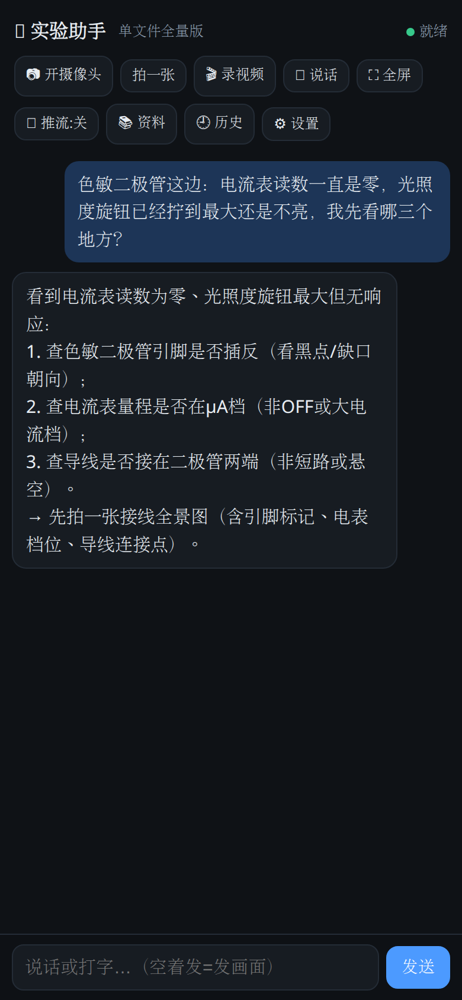
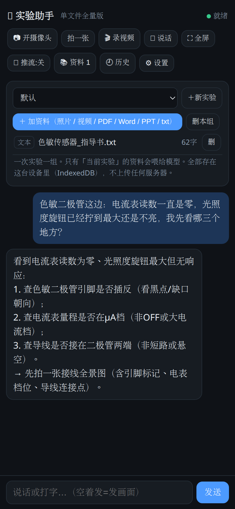

# Lab Assistant (实验助手)

[中文说明 →](README.md)


> ⚠️ **Alpha / work in progress.** Built from scratch by one student for their own lab course,
> never tested by anyone else. Expect bugs and rough edges. Tinker at your own risk.
>
> 🧃 **Vibe coded**: most of the code was written by **pair-programming with an AI** (vibe coding).
> The features are real and tested on a real phone against real APIs, but the code grew
> conversation-by-conversation — inconsistent naming and structure. **Don't use it as an
> engineering reference**; treat it as a working prototype.

**A voice + vision lab assistant you point your phone at.** Open the page in a mobile browser:
aim the camera at your equipment and ask out loud. It sees what you see, hears what you say,
walks you through the steps, and reads the answer aloud.

<p align="center">
  
</p>

Self-hosted, single-file backend, runs on a 2C2G VPS. The only external deps are cloud APIs
(a chat model, an ASR model, a TTS voice).

## 30-second start (no server needed)

Grab [`standalone.html`](standalone.html) — **one file, almost all features**
(document library / photo Q&A / video Q&A / voiceprint / spoken answers):

1. Put it on any static host (GitHub Pages / Vercel), or serve it locally
   (`python3 -m http.server 8000`)
2. Open it → **⚙️ paste one API key** (defaults to Alibaba DashScope; one key covers chat + vision + ASR)
3. Open it on your phone (**https or localhost required** — browsers block the camera otherwise)
   → snap a photo or record a clip → just ask

<p align="center">
  
</p>

Need cross-device sharing or a shared document library → use the [self-hosted version](#run-it).

## What it costs

Only model API money; a 2C2G box (or your laptop) is enough:

- **See + answer**: a few thousand tokens per question — with a cheap model (e.g. `qwen-plus`)
  that is **a fraction of a cent**; dozens of questions a day ≈ a coffee per month
- **Transcription** (video narration / voice input): billed per audio second, tiny
- **Spoken answers**: the standalone version uses your phone's built-in TTS — **free**

## Where it is useful

Nothing in the code is tied to a specific school or course — course material lives in an
external `lab_context.md` plus a runtime document library. The same shell works for:

- **Any lab course** (physics / electronics / chemistry / biology): put your equipment notes
  into `lab_context.md`, photograph the manual, and students can ask while they work
- **Repair / assembly guidance**: point the camera at a machine and ask "where does this cable go"
- **Hands-on training**: a trainee operates the instrument while the assistant watches and corrects
- Any hands-busy situation where someone needs to be guided while looking at something

> This repo is a **scrubbed shell**: code and config samples only. No keys, voiceprints,
> sessions, course material, certificates or model weights.

## Features

- **Manual / auto mode**: push-to-talk, or hands-free (browser-side VAD)
- **It can see**: camera stays on, the frame is attached when you ask; full-screen preview and 1×/2×/3× zoom
- **Video switch**: while on, 1 frame/s is pushed (unchanged frames skipped, ~zero traffic when idle);
  after you turn it off, questions still carry the last captured frames
- **Send a video in the chat** (🎬): record while narrating; frames are sampled and your speech is
  transcribed — made for "I'm stuck, look at this"
- **Document library**: photos / PDF / Word / PPT / **video** go straight into context, grouped per experiment
- **Voiceprint (optional)**: "only my voice" (sherpa-onnx + CAM++, CPU-only, ~30MB)
- Multi-session history, editable system prompt, 4 thinking levels, optional web search, filler lines

There is also a **:8900 realtime page** (full-duplex voice, relaying Qwen-Omni-Realtime): `app.py` + `index.html`.

## No server? Use the standalone build (`standalone.html`)

One file, no backend, no install — drop it on any static host and open it on your phone:

- **Document library** in the browser (IndexedDB): photos / videos / **PDF / Word / PPT** / txt,
  grouped per experiment; the active group goes into context automatically
  (photos → vision OCR; PDF → parsed locally, scanned pages rendered for the model;
  Word/PPT → unzipped locally; video → 4 frames + narration transcript)
- **Voiceprint "only my voice"** (optional): CAM++ runs *in the browser*, bit-for-bit aligned with
  the Python sherpa-onnx pipeline (measured cosine 0.99998). Enroll 3 short clips; speech that is
  not you is refused. Needs `campplus_sv_advanced.onnx` (28MB) next to the HTML as `./campplus.onnx`,
  or a URL in settings.
- **Multi-session history**, editable prompt, **spoken answers** (phone TTS), optional web search,
  fullscreen / zoom, frame buffering
- Everything (docs, chats, voiceprint, API key) stays **on the device**

**Versus the server version**, only one thing is missing: **cross-device sharing** — that needs a
shared home, i.e. a server.

## FAQ

**Camera doesn't open?** Browsers require **https or localhost**; `file://` is blocked in some browsers.

**"Auto mode" says the engine failed to load?** It downloads a ~2.9MB inference engine on first use
(gzipped). On a weak link it fails — **tap it again and it retries** (no reload needed).

**Where does the voiceprint model come from?** By default `./campplus.onnx` next to the HTML
([CAM++ zh/en general model](https://www.modelscope.cn/models/iic/speech_campplus_sv_zh_en_16k-common_advanced), 28MB).

**Can I use OpenAI / Gemini / a local model?** Yes. The standalone build has **provider presets**
(DashScope / OpenAI / DeepSeek / SiliconFlow / Zhipu / Kimi / local Ollama / custom) that fill in the
base URL and model names for you — and you can use one provider for chat and another for vision/ASR.
For the server build, edit `.env` (see the provider list in `.env.example`).

**Is my data uploaded?** Standalone: docs/chats/voiceprint/key stay in your browser; only the
current question (text + this round's frames) goes to the model API you configured. Same for the
server build, plus your own box in the middle.

## Architecture

```
phone browser ──HTTPS/WSS──> this service (single-file aiohttp) ──> cloud APIs
  · frame sampling, zoom, fullscreen     · /ask  → chat model (with images)
  · record → upload for transcription    · /stt /tts
  · browser-side VAD (auto mode)         · /docs → library (photos via vision OCR, video = frames + transcript)
  · voiceprint check on the server (~30MB ONNX)
```

**Heavy work stays in the phone browser** (sampling, VAD, recording, playback); the server only
forwards and calls APIs — each service idles below 1MB RSS.

## Run it

```bash
git clone <this-repo> && cd lab-assistant
python3 -m venv venv && ./venv/bin/pip install -r requirements.txt
bash scripts/fetch_vad_assets.sh        # browser-side VAD assets (auto mode)
cp .env.example .env && vi .env          # API keys
cp lab_context.example.md lab_context.md # your course equipment & experiments (optional)
./venv/bin/python lab_server.py
```

- Camera/mic need **HTTPS**. A self-signed cert is fine (tap "Advanced → Proceed" on the phone).
- Cert paths live in `lab_server.py` (cert.pem / key.pem); generate your own:
  `openssl req -x509 -newkey rsa:2048 -nodes -keyout key.pem -out cert.pem -days 3650 -subj "/CN=lab" -addext "subjectAltName=IP:192.168.1.10"`
- For long-running use, make it a systemd user service (`Restart=always`, `EnvironmentFile`, mode 600).

## Swapping models / providers

Everything goes through env vars (see `.env.example`): `LAB_MODEL` (chat), `LAB_OCR_MODEL`
(vision OCR), `LAB_ASR_MODEL` (speech-to-text). The defaults use DeepSeek + Alibaba DashScope
(both OpenAI-compatible); switching vendors means editing the base URLs and key variables
in `lab_server.py`.

## Known trade-offs

- **Turn-based** (not streaming): answers can take 3–9s; a cheap "filler line" covers the wait.
  Lower latency needs a realtime model.
- Auto mode downloads a ~2.9MB inference engine on first use (gzipped); on a bad link it may fail —
  it tells you and retries.
- Frame sampling adapts to clip length (every 2s ≤20s / 4s ≤60s / 8s beyond), at the official ~1 fps order of magnitude.
- No on-device inference and no tool-calling: at the bench you want to be told what to do, not have the agent do it.

## Roadmap / help wanted

- [x] English UI + prompts (i18n: auto by browser language, switchable; add a table in `static/i18n.js` for a new language)
- [ ] Drop-in support for other providers (OpenAI / Gemini / local Ollama)
- [ ] Better weak-network experience (resumable uploads, offline sampling)
- [ ] One-command deploy (docker-compose / systemd template)

## Come hack on it (contributions welcome)

**Status**: it runs and the author uses it daily, but it has **only ever been tested in one course**.
Help of any kind is welcome — code, bug reports, "I want X", or just telling me where you use it.

**Especially wanted (claim one, or just open an issue saying "I'll do it"):**

- 🔌 **Other providers**: OpenAI / Gemini / local Ollama
- 🌐 **More languages**: add one table to `static/i18n.js` — a single-commit job
- 📶 **Weak-network UX**: resumable uploads, auto-retry, offline sampling
- 📱 **Tablet / landscape** support, screen sharing
- 🧑🏫 **Real classroom trial**: take it to one lab session and file an issue with
  "where it was dumb / wrong" — **more valuable than code**
- 🐛 **Just use it and complain**: device, browser, what broke

**Start here:** [`CONTRIBUTING.md`](CONTRIBUTING.md). Rough contributions are fine — an issue first is fine too.

## Changelog

- **2026-09-12** Standalone build became **feature-complete** (local document library / sessions /
  TTS / web search / **in-browser voiceprint**); 🎬 record-and-ask video in chat
- **2026-09-12** Document library supports video; auto-mode VAD loads on demand, gzipped (11MB → 2.9MB)
- **2026-09-11** Bilingual UI (zh/en); scrubbed public shell

## License

MIT
